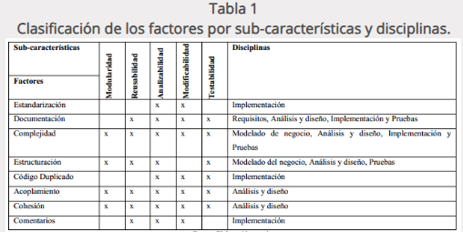
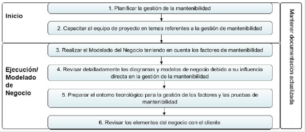
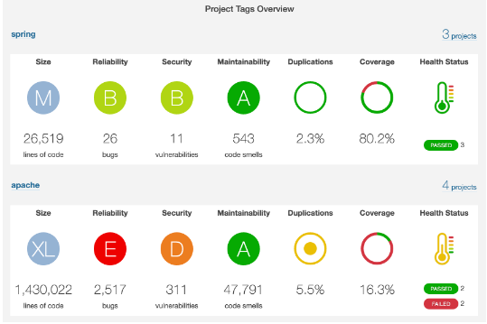

# ADA 2.1. Atributos de Calidad en el Diseño del Software

## Mantenibilidad

## El estándar ISO 9126 
El estándar ISO 9126 **define un modelo de calidad del software en el que la calidad se define como la totalidad de características relacionadas con su habilidad para satisfacer necesidades establecidas o implicadas**. Los atributos de calidad se clasifican según seis características, las cuales a su vez se subdividen en subcaracterísticas. En este estándar se establece que cualquier componente de la calidad del software puede ser descrito en términos de algunos aspectos de una o más de estas seis características.
Sin embargo, para este propósito particular, nos centraremos en el atributo denominado como **mantenibilidad**.

## Definición de Mantenibilidad según ISO 9126
La mantenibilidad se define como la capacidad de un producto software para ser modificado. Las modificaciones pueden incluir correcciones, mejoras o adaptación del software a cambios en el entorno, en los requerimientos o en las especificaciones funcionales. Se subdivide en cinco subcaracterísticas:

- **Analizabilidad:** Capacidad del producto software de diagnosticar sus deficiencias o causas de fallos, o de identificar las partes que deben ser modificadas.
- **Cambiabilidad:** Capacidad del producto software de permitir implementar una modificación especificada previamente. La implementación incluye los cambios en el diseño, el código y la documentación. Si el software es modificado por el usuario final, entonces, la cambiabilidad puede afectar a la operabilidad.
- **Estabilidad:** Capacidad del producto software de minimizar los efectos inesperados de las modificaciones.
- **Facilidad de prueba:** Capacidad del producto software de permitir evaluar las partes modificadas.
- **Conformidad:** Capacidad del producto software de satisfacer los estándares o convenciones relativas con la mantenibilidad.

## Mantenibilidad (Caso Real)
---
Un grupo de desarrolladores en Cuba decidió realizar una investigación acerca del impacto que tiene la buena o mala gestión de la mantenibilidad en un producto de software.
Para obtener evidencia empírica del impacto de la mantenibilidad decidieron encuestar a dos empresas desarrolladoras de software, de donde obtuvieron los siguientes resultados:

- El 60% de los encuestados afirma que la mantenibilidad debe gestionarse desde etapas tempranas en el ciclo de vida de software, con el objetivo de evitar consecuencias negativas en el proceso.
- El 70% de los encuestados expresó la necesidad de capacitar a los equipos de desarrollo acerca de temas de mantenibilidad.

Posterior a esta encuesta, se decidió vincular factores de la **mantenibilidad** con subcaracterísticas de este atributo (definidas por el modelo de calidad) y las diversas etapas del desarrollo de ciclo de vida de software donde estos factores pueden estar presentes. De este planteamiento se produjó la siguiente tabla:

La clasificación anterior dió un aporte significativo al proceso, pues se pudieron delimitar actividades correspondientes a cada una de las fases con el objetivo de gestionar de manera correcta la mantenibilidad. Dado que la intención es gestionar este atributo desde etapas tempranas del ciclo de vida, durante el inicio del proceso se realizaron las siguientes actividades:

Notemos que varias de estas actividades se plantearon como resultado de lo obtenido en las encuestas realizadas en el inicio de la investigación. Durante el diseño, se tomaron en cuenta las métricas y las subcaracterísticas del mantenimiento asociadas a esta etapa, esto dio pie a la creación de la siguiente tabla de actividades:

Finalmente, se destacó el uso de una herramienta llamada **SonarQube**, la cual es una plataforma de código abierto que puede ser usada por los equipos de desarrollo para medir, entre otras cosas, la mantenibilidad un sistema de software a partir del código fuente. 

## La Mantenibilidad en el Proyecto
---

Tomando en cuenta el ejemplo práctico mencionado anteriormente consideramos como una opción viable el uso del software SonarQube, el cual, **brinda una gran cantidad de funcionalidades para la detección de código duplicado, no adecuación a estándares y convenciones de código, vulnerabilidades conocidas de seguridad, complejidad ciclomática y acoplamiento**. La mayoría de estas métricas están altamente relacionadas con la mantenibilidad del software y su evaluación nos permite establecer un marco de referencia para poder determinar de forma objetiva si nuestro sistema carece o no de este atributo.

## Referencias
---
* https://alarcos.esi.uclm.es/per/fruiz/curs/mso/trans/S3.pdf
* https://www.redalyc.org/journal/3783/378370462021/html/
* https://www.redalyc.org/journal/3783/378366538004/html/

