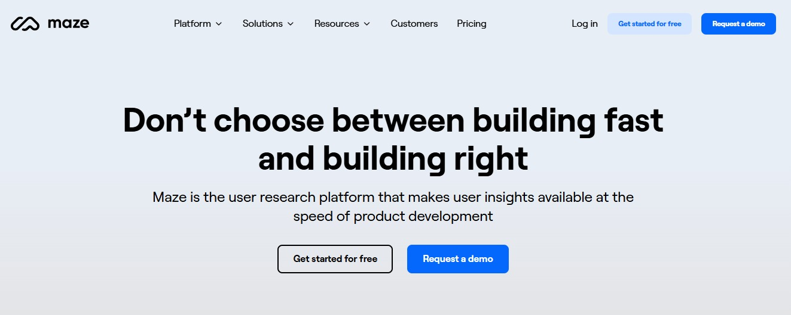
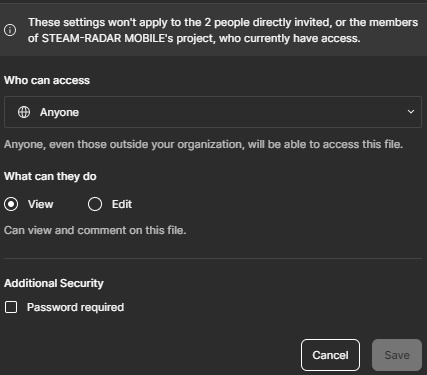

# Sesión Práctica usando Maze

## Introducción
La siguiente descripción corresponde a la sesión práctica realizada por el equipo para la asignatura de Diseño de Software. La sesión consiste en el uso de la herramienta de Maze como una manera de medir u obtener datos de la usabilidad de un sistema de software. Para ello, durante la sesión se necesitaron de los siguientes pasos:

* [Contextualización de la sesión](#contextualización-de-la-sesión)
* [Aplicación de una encuesta de usabilidad](#aplicación-de-una-encuesta-de-usabilidad)
* [Definición de usabilidad](#definición-de-usabilidad)
* [Métricas de usabilidad en Maze](#métricas-de-usabilidad-en-maze)
* [¿Cómo mide la usabilidad Maze?](#cómo-mide-la-usabilidad-maze)

## Requisitos Previos
Para poder realizar la sesión práctica, es necesario tener lo siguiente:

* Cuenta gratuita de Maze
* Prototipo de un sistema en Figma

### ¿Cómo crear una cuenta en Maze?
Como ya mencionamos, es primordial contar con al menos la cuenta gratuita de Maze. Para ello, enlistamos los siguientes pasos:

1. Dirígete a la página principal de Maze en [https://maze.co/](https://maze.co/) y presiona el botón *Ger started free*:

2. Inicie sesión con una cuenta de correo electrónico o mediante Google:

3. Rellene los datos que solicite Maze (nombre de usuario, motivo de uso, etc.).

Con estos tres pasos es suficiente para contar con la versión gratis de Maze.

### ¿Cómo conectar el prototipo de Figma con Maze?
Para este punto, es necesario tener un prototipo de un sistema ya hecho en Figma. La manera en la que se conecta el prototipo con Maze es a través de las encuestas de Usabilidad, donde éstas tienen un bloque *Task* o *Mission Block*:

1. Dirígete a la pantalla principal de Maze en tu cuenta y presiona el botón de *New Project*:

2. Cree un Maze en blanco:

3. Agregue un *Mission Block* y se te presentará la siguiente pantalla:

4. En Figma, dirígete a la parte superior derecha de la aplicación y aprieta el botón *Share*:

5. Configure el enlace de Figma a *Anyone with the link can view* y copie el enlace:

6. En la pantalla del *Mission Block*, seleccione la opción de *Add prototype* y pegue el enlace:

De esta manera, puede comenzar a crear su propia encuesta de usabilidad con rutas a tarvés de los prototipos de Figma,

## Contextualización de la sesión
El equipo propone para la futura asignatura de *Arquitectura de Software* realizar una aplicación móvil del sistema *STEAM RADAR*, que actualmente presenta una interfaz para escritorio. Por ello, esta sesión práctica sirvió para probar el concepto (las vistas) del sistema en su versión móvil.

Por tanto, mediante Figma se crearon algunas vistas (las primordiales) de *STEAM RADAR*

## Aplicación de una encuesta de usabilidad
El equipo otorgó 5 minutos a los participantes para la realización de una encuesta en Maze con el propósito de obtener métricas y poder observar cómo la plataforma de Maze consigue medir el atributo de calidad de **Usabilidad**.

Presione [aquí](https://t.maze.co/236620419) para acceder a la encuesta de la sesión

## Definición de usabilidad
McCall define la usabilidad como el esfuerzo requerido para aprender, operar, ingresar entradas e interpretar la salida de un programa. Trata de responder a la pregunta *_"¿Puedo ejecutarlo?"_*. Asímismo, consta de varios aspectos:
* **_Operabilidad:_** atributos que determinan la facilidad de operación del software.
* **_Aprendizaje:_** atributos que facilitan la familiarización inicial del usuario con el software y la transición del modo actual de operación.

## Métricas de usabilidad en Maze
Algunas métricas de usabilidad que pueden obtenerse a través de las encuestas realizadas por Maze son las siguientes:

* Tiempo requerido para cumplir una tarea
* Número y porcentaje de tareas realizadas incorrectamente
* Tiempo que le toma al usuario en aprender el sistema en un nivel considerable (hasta un 50% del total de funciones del sistema)
* Tasa de errores
* Números de clicks incorrectos

## ¿Cómo mide la usabilidad Maze?
En primer lugar, Maze obtiene una puntuación de 0 a 100 por cada vista, misión y desafío.
* Screen Usability Score (SCUS)
* Mission Usability Score (MIUS)
* Maze Usability Score (MAUS)
 

La manera que se pueden interpretar los resultados es:
* Alto: 81 - 100
* Medio: 51 - 80
* Bajo: 0 - 50

Un aspecto importante de este valor es que no determina el qué tan bien diseñado esté el prototipo, sino la facilidad de completar correctamente y navegar entre todas las funciones.

Para más información a detalle de los cálculos de cada puntación. Consulte este [enlace](https://help.maze.co/hc/en-us/articles/360052723353-How-your-Usability-Score-is-calculated?_gl=1*1c60cm4*_gcl_au*OTkxMTgwMjQ0LjE3MTUxMDQ1NjA.)

Por otro lado, por cada *Mission Block* tenemos sus respectivas métricas, por ejemplo:

Observamos que se presentan un nivel de usabilidad (el explicado anteriormente) y que corresponde a la tarea en cuestión (no a todas). También presenta varias métricas que a continuación describiremos de izquierda a derecha:

* **_Porcentaje de éxito en la tarea:_** valor que se obtiene de dividir el número de participantes que completaron correctamenta la tarea en el *happy path* entre el total de participantes que ingresaron a la encuesta.
* **_Porcentaje de tarea no finalizada:_** este valor muestra el porcentaje de participantes que no consiguieron completar la tarea.
* **_Porcentaje de clicks erróneos:_**  este valor muestra el porcentaje de clicks que los participantes realizaron en los prototipos en lugares donde no se correspondía hacer contacto.
* **_Promedio de duración de tarea:_** como su nombre lo indica, es una media del tiempo que le tomó a los participantes completar la tarea.

## Recursos
Se adjunta el siguiente [enlace](Recursos/) donde se puede obtener el prototipo usado para la sesión, así como la presentación.
